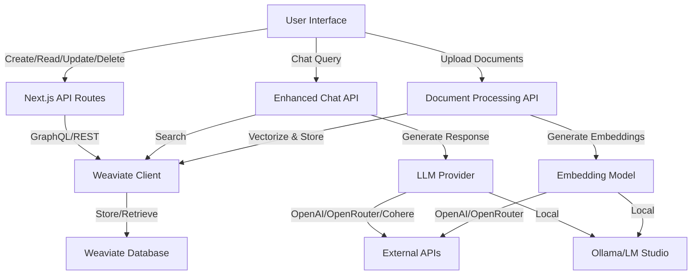

# 🧠 Weaviate Local UI by Zorost Intelligence

A modern user interface for managing and exploring **local Weaviate** vector database instances.

> **Developed by [Zorost Intelligence LLC](https://zorost.com)**  
> Independent project – **not affiliated with or endorsed by Semi Technologies B.V. or the official Weaviate Cloud Service**.  
>  
> This UI connects to any self-hosted Weaviate backend via its public API and helps users inspect schema, classes, and objects with a clean dashboard experience.

---

### ⚖️ Licensing

- **Zorost Local UI**: Licensed under the [MIT License](./LICENSE) © 2025 Zorost Intelligence LLC  
- **Weaviate (backend)**: Licensed under the [BSD 3-Clause License](./LICENSE-Weaviate) © Semi Technologies B.V.  

"Weaviate" and related marks are trademarks of Semi Technologies B.V.  
All other trademarks belong to their respective owners.

---

### 🌐 Links

- [Official Weaviate Open-Source Repository](https://github.com/weaviate/weaviate)  
- [Zorost Intelligence Website](https://zorost.com)

---

### ⚡ Quick Start in 3 Steps

```bash
# 1. Clone the repository
git clone https://github.com/zorost/Zorost-Local-UI-for-Weaviate.git
cd Zorost-Local-UI-for-Weaviate/weaviate-local-app

# 2. Start Weaviate & Services
docker-compose up -d

# 3. Launch the app
npm install && npm run dev
```

**🎉 Done!** Open [http://localhost:9501](http://localhost:9501)

</div>

---

## 📋 Table of Contents

- [✨ Features](#-features)
- [🏗️ Architecture](#️-architecture)
- [🚀 Quick Start](#-quick-start)
- [📦 Installation](#-installation)
- [💡 Usage](#-usage)
- [🔧 Configuration](#-configuration)
- [🤖 AI & LLM Integration](#-ai--llm-integration)
- [📊 Screenshots](#-screenshots)
- [🛠️ API Documentation](#️-api-documentation)
- [🤝 Contributing](#-contributing)
- [📄 License](#-license)
- [🙏 Acknowledgments](#-acknowledgments)

---

## ✨ Features

### 🎯 Core Features

<table>
<tr>
<td width="50%">

#### 🗄️ **Vector Database Management**
- ✅ Create, Read, Update, Delete classes
- ✅ Manage objects with full CRUD operations
- ✅ Advanced schema configuration
- ✅ Real-time statistics dashboard
- ✅ Object count tracking per class

</td>
<td width="50%">

#### 🤖 **AI-Powered Chat Interface**
- ✅ RAG (Retrieval Augmented Generation)
- ✅ Multi-provider LLM support
- ✅ Context-aware responses
- ✅ Source citation & attribution
- ✅ Chat history export

</td>
</tr>
<tr>
<td width="50%">

#### 📄 **Document Processing**
- ✅ Upload PDFs, TXT, MD, CSV, JSON
- ✅ Automatic text extraction
- ✅ Smart chunking strategies
- ✅ Embedding generation
- ✅ Batch processing

</td>
<td width="50%">

#### 🔍 **Advanced Search**
- ✅ Semantic vector search
- ✅ Keyword (BM25) search
- ✅ Hybrid search combining both
- ✅ Comprehensive search with deduplication
- ✅ Filtering and pagination

</td>
</tr>
<tr>
<td width="50%">

#### 🎨 **Modern UI/UX**
- ✅ Beautiful dark/light themes
- ✅ Responsive design
- ✅ Professional components
- ✅ Real-time updates
- ✅ Intuitive interface

</td>
<td width="50%">

#### 🔐 **Security & Authentication**
- ✅ API key authentication
- ✅ Secure local storage
- ✅ Environment variable support
- ✅ CORS configuration
- ✅ Production-ready

</td>
</tr>
</table>

### 🌟 Advanced Features

- **📊 Data Export/Import**: Export to JSON/CSV, import from multiple formats
- **🔄 Chunk Management**: View, search, and delete individual chunks
- **📈 Real-time Statistics**: Live dashboard with class counts and metrics
- **🌐 External API**: RESTful API for platform integration
- **🐳 Docker Support**: Containerized deployment with Docker Compose
- **🔗 Network Integration**: Connect with N8N, Flowise, and other tools
- **💾 Backup & Restore**: Complete database backup and restoration
- **🎯 Multiple Embedding Models**: OpenAI, OpenRouter, Local LLMs

---

## 🏗️ Architecture

```
┌─────────────────────────────────────────────────────────────────┐
│                     Weaviate Local App (Next.js 15)             │
│                                                                 │
│  ┌──────────────┐  ┌──────────────┐  ┌──────────────┐         │
│  │   Dashboard  │  │ Data Browser │  │  AI Assistant │         │
│  │              │  │              │  │              │         │
│  │  • Stats     │  │  • Classes   │  │  • Chat      │         │
│  │  • Metrics   │  │  • Objects   │  │  • RAG       │         │
│  │  • Status    │  │  • Search    │  │  • Sources   │         │
│  └──────────────┘  └──────────────┘  └──────────────┘         │
│                                                                 │
│  ┌─────────────────────────────────────────────────────────┐   │
│  │              API Routes (Next.js API)                    │   │
│  │                                                          │   │
│  │  /api/weaviate/*  /api/chat/*  /api/documents/*        │   │
│  └─────────────────────────────────────────────────────────┘   │
└─────────────────────────────────────────────────────────────────┘
                              ▼
┌─────────────────────────────────────────────────────────────────┐
│                        Weaviate Vector DB                       │
│                          (Docker)                               │
│                                                                 │
│  • Vector Storage        • GraphQL API      • RESTful API      │
│  • Semantic Search       • Indexing         • CRUD Operations  │
└─────────────────────────────────────────────────────────────────┘
                              ▼
┌─────────────────────────────────────────────────────────────────┐
│                      LLM Providers                              │
│                                                                 │
│  ┌──────────┐  ┌──────────┐  ┌──────────┐  ┌──────────┐      │
│  │  OpenAI  │  │OpenRouter│  │  Cohere  │  │Local LLM │      │
│  └──────────┘  └──────────┘  └──────────┘  └──────────┘      │
└─────────────────────────────────────────────────────────────────┘
```

### Component Flow



---

## 🚀 Quick Start

### Prerequisites

- **Node.js** 18+ ([Download](https://nodejs.org/))
- **Docker** & Docker Compose ([Download](https://www.docker.com/get-started))
- **Git** ([Download](https://git-scm.com/))

### Installation

1. **Clone the repository**
   ```bash
   git clone https://github.com/zorost/Zorost-Local-UI-for-Weaviate.git
   cd Zorost-Local-UI-for-Weaviate/weaviate-local-app
   ```

2. **Set up environment variables**
   ```bash
   cp env.template .env.local
   ```
   
   Edit `.env.local`:
   ```env
   WEAVIATE_HOST=localhost
   WEAVIATE_PORT=8080
   WEAVIATE_SCHEME=http
   WEAVIATE_API_KEY=admin-key
   ```

3. **Start Weaviate with Docker**
   ```bash
   docker-compose up -d
   ```
   
   Wait 10-15 seconds for Weaviate to initialize.

4. **Install dependencies**
   ```bash
   npm install
   ```

5. **Start the development server**
   ```bash
   npm run dev
   ```

6. **Open your browser**
   ```
   http://localhost:9501
   ```

### 🎉 You're Ready!

---

## 📦 Installation

### Option 1: Docker (Recommended)

```bash
# Start all services
docker-compose up -d

# Check status
docker-compose ps

# View logs
docker-compose logs -f weaviate

# Stop services
docker-compose down
```

### Option 2: Manual Setup

See [SETUP.md](./SETUP.md) for detailed manual installation instructions.

### Option 3: Production Deployment

```bash
# Build for production
npm run build

# Start production server
npm start
```

---

## 💡 Usage

### 1. Dashboard

View real-time statistics and system status:

- **Total Classes**: Number of data schemas
- **Total Objects**: Number of stored objects
- **Version**: Application version
- **Node**: Weaviate node information

### 2. Data Browser

Manage your vector database:

```bash
# Create a new class
Click "+ New Class" → Configure → Create

# View objects
Select a class → Browse objects → View details

# Search
Enter query → Semantic/Keyword/Hybrid search

# Export data
Select class → ⋮ Menu → Export JSON/CSV

# Delete class
Select class → ⋮ Menu → Delete Class
```

### 3. AI Assistant

Chat with your data using RAG:

1. **Select a class** from the dropdown
2. **Configure LLM** (Settings icon)
   - Choose provider (OpenAI, OpenRouter, Local LLM)
   - Enter API key
   - Select model
3. **Ask questions** about your data
4. **View sources** for each response

---

## 🔧 Configuration

### Environment Variables

| Variable | Description | Default |
|----------|-------------|---------|
| `WEAVIATE_HOST` | Weaviate server host | `localhost` |
| `WEAVIATE_PORT` | Weaviate server port | `8080` |
| `WEAVIATE_SCHEME` | HTTP or HTTPS | `http` |
| `WEAVIATE_API_KEY` | Authentication key | `admin-key` |

### Docker Compose Configuration

Edit `docker-compose.yml` to customize:

- **Ports**: Change exposed ports
- **Volumes**: Persist data location
- **Environment**: Weaviate settings
- **Authentication**: Enable/disable auth

### Chunking Strategies

| Strategy | Description | Best For |
|----------|-------------|----------|
| **Recursive** | Respects sentence boundaries | General documents |
| **Fixed** | Fixed-size chunks | Uniform content |
| **Semantic** | Sentence-based chunking | Natural language |

**Recommended Settings:**
- Chunk Size: 300-800 tokens
- Overlap: 10-20% of chunk size

---

## 🤖 AI & LLM Integration

### Supported Providers

#### 1. OpenAI
```javascript
Provider: OpenAI
Models:
  - gpt-4o
  - gpt-4-turbo
  - gpt-3.5-turbo
Embeddings:
  - text-embedding-3-small (Recommended)
  - text-embedding-3-large
  - text-embedding-ada-002
```

#### 2. OpenRouter
```javascript
Provider: OpenRouter
Access: 500+ models from 60+ providers
Models:
  - anthropic/claude-3.7-sonnet
  - openai/gpt-4o
  - google/gemini-pro
Embeddings:
  - Via OpenAI models
```

#### 3. Local LLMs (Ollama)
```bash
# Install Ollama
curl -fsSL https://ollama.ai/install.sh | sh

# Pull models
ollama pull llama2
ollama pull mistral
ollama pull nomic-embed-text

# Default endpoint
http://localhost:11434/api/generate
```

#### 4. Cohere
```javascript
Provider: Cohere
Models:
  - command-r
  - command-light
```

### Setting Up API Keys

1. Click **Settings** icon in AI Assistant
2. Select your **provider**
3. Enter your **API key**
4. Select a **model**
5. Keys are **saved locally** in browser

---

## 📊 Screenshots

### Dashboard

*Real-time statistics and system monitoring*

### Data Browser

*Manage classes and objects with advanced search*

### AI Assistant

*RAG-powered chat interface with source citations*

### Document Processing

*Upload and process documents with embedding configuration*

---

## 🛠️ API Documentation

### RESTful API Endpoints

| Endpoint | Method | Description |
|----------|--------|-------------|
| `/api/weaviate/status` | GET | Connection status |
| `/api/weaviate/stats` | GET | Database statistics |
| `/api/weaviate/classes` | GET, POST | List/Create classes |
| `/api/weaviate/classes/[name]` | DELETE | Delete class |
| `/api/weaviate/objects/[class]` | GET, POST | List/Create objects |
| `/api/weaviate/search` | POST | Semantic search |
| `/api/chat/enhanced` | POST | RAG chat |
| `/api/documents/process` | POST | Process documents |
| `/api/models` | POST | Fetch LLM models |

### Example: Create a Class

```bash
curl -X POST http://localhost:9501/api/weaviate/classes \
  -H "Content-Type: application/json" \
  -d '{
    "className": "Documents",
    "description": "Document storage",
    "vectorizer": "none"
  }'
```

### Example: Chat Query

```bash
curl -X POST http://localhost:9501/api/chat/enhanced \
  -H "Content-Type: application/json" \
  -d '{
    "message": "What are the key findings?",
    "className": "Documents",
    "llmProvider": "openai",
    "apiKey": "sk-...",
    "selectedModel": "gpt-4o"
  }'
```

**Full API Documentation**: [API_DOCUMENTATION.md](./API_DOCUMENTATION.md)

---

## 🚢 Deployment

### Docker Production Deployment

```bash
# Build production image
docker build -t weaviate-local-app .

# Run container
docker run -p 9501:9501 weaviate-local-app
```

### Vercel Deployment

```bash
# Install Vercel CLI
npm i -g vercel

# Deploy
vercel --prod
```

### Environment Setup

Ensure all environment variables are set in your deployment platform:
- Vercel: Project Settings → Environment Variables
- Docker: Use `docker-compose.prod.yml`
- Other: Set via platform-specific configuration

---

## 🤝 Contributing

We welcome contributions! Please see [CONTRIBUTING.md](./CONTRIBUTING.md) for guidelines.

### Quick Contribution Guide

1. **Fork** the repository
2. **Create** a feature branch (`git checkout -b feature/AmazingFeature`)
3. **Commit** your changes (`git commit -m 'Add AmazingFeature'`)
4. **Push** to branch (`git push origin feature/AmazingFeature`)
5. **Open** a Pull Request

### Development Setup

```bash
# Clone your fork
git clone https://github.com/your-username/Zorost-Local-UI-for-Weaviate.git

# Create branch
git checkout -b feature/my-feature

# Make changes and test
npm run dev
npm run lint
npm run type-check

# Commit and push
git add .
git commit -m "Description of changes"
git push origin feature/my-feature
```

---

## 🐛 Troubleshooting

### Common Issues

**Issue**: Cannot connect to Weaviate
```bash
# Solution: Check if Weaviate is running
docker-compose ps
docker-compose logs weaviate

# Restart services
docker-compose restart
```

**Issue**: Port 9501 already in use
```bash
# Solution: Change port in package.json
"dev": "next dev --port 3000"
```

**Issue**: API key not persisting
```bash
# Solution: Check browser localStorage
# Open DevTools → Application → Local Storage
# Verify weaviate-app-api-keys exists
```

**Issue**: Class creation fails
```bash
# Solution: Ensure class name is PascalCase
✅ MyClass, Documents, TestData
❌ myClass, my-class, my_class
```

For more help, see [SETUP.md](./SETUP.md) or [open an issue](https://github.com/zorost/Zorost-Local-UI-for-Weaviate/issues).

---

## 📚 Documentation

- **[Quick Start](./QUICKSTART.md)** - Get started in 5 minutes
- **[Setup Guide](./SETUP.md)** - Detailed installation
- **[API Documentation](./API_DOCUMENTATION.md)** - API reference
- **[OpenRouter Integration](./OPENROUTER_INTEGRATION.md)** - OpenRouter setup
- **[Contributing](./CONTRIBUTING.md)** - Contribution guidelines

---

## 🎯 Roadmap

- [ ] Multi-language support (i18n)
- [ ] Advanced data visualization
- [ ] Batch import from CSV/JSON
- [ ] GraphQL playground
- [ ] Mobile responsive optimization
- [ ] Plugin system for extensions
- [ ] Cloud backup integration
- [ ] Team collaboration features

---

## 📄 License

### 🧭 Project Overview

This repository contains a custom **User Interface (UI)** developed by **Zorost Intelligence LLC ("Zorost")** for local and private deployments of the **Weaviate** vector database.

The project's purpose is to simplify configuration, data exploration, and administration for users running Weaviate in self-hosted or on-premise environments. Zorost's UI communicates with Weaviate through its **public API interfaces** and does **not** modify or redistribute any proprietary or cloud-hosted Weaviate code.

### ⚖️ Dual Licensing

This project contains two licensed components:

| Component | License | Owner | Details |
|-----------|---------|-------|---------|
| **Weaviate (backend)** | BSD 3-Clause | Semi Technologies B.V. | See [LICENSE-Weaviate](LICENSE-Weaviate) |
| **Zorost UI (this project)** | MIT | Zorost Intelligence LLC | See [LICENSE](LICENSE) |

**Important Notes:**
- This UI is an **independent project** developed by **Zorost Intelligence LLC**
- **Zorost is not affiliated with, endorsed by, or sponsored by Semi Technologies B.V.** or the Weaviate project
- "Weaviate" and all related marks are trademarks of Semi Technologies B.V.
- This project integrates with the open-source version of Weaviate under the BSD 3-Clause License

### 📋 Redistribution Requirements

If you redistribute this UI with a Weaviate instance:
1. Include both LICENSE files (MIT and BSD)
2. Retain all copyright notices
3. Do not imply endorsement by Weaviate/Semi Technologies
4. Use factual compatibility descriptions only

**Full licensing details**: See [LICENSE](LICENSE) and [LICENSE-Weaviate](LICENSE-Weaviate)

**Questions?** Contact: legal@zorost.com

---

## 🙏 Acknowledgments

### Special Thanks to Weaviate

This application is inspired by and built upon the excellent work of the **[Weaviate](https://weaviate.io/)** team. Weaviate is an amazing AI-native vector database that powers this application.

**Weaviate Resources:**
- **Website**: [https://weaviate.io/](https://weaviate.io/)
- **Documentation**: [https://docs.weaviate.io/](https://docs.weaviate.io/)
- **GitHub**: [https://github.com/weaviate/weaviate](https://github.com/weaviate/weaviate)
- **Cloud Console**: [https://console.weaviate.cloud/](https://console.weaviate.cloud/)

We are grateful for their comprehensive documentation, robust APIs, and commitment to open-source development. This local application aims to make Weaviate more accessible to users who want to run it locally without cloud dependencies.

### About This Project

This free, open-source application is designed for users who want to:
- Run Weaviate locally on their own infrastructure
- Have full control over their data and privacy
- Experiment with vector databases without cloud costs
- Learn and develop with Weaviate's powerful features

**Thank you, Weaviate team, for building such an incredible platform!** 🙏

### Built With

- [Next.js](https://nextjs.org/) - React Framework
- [TypeScript](https://www.typescriptlang.org/) - Type Safety
- [Tailwind CSS](https://tailwindcss.com/) - Styling
- [Radix UI](https://www.radix-ui.com/) - UI Components
- [Weaviate](https://weaviate.io/) - Vector Database

---

<div align="center">

## 💬 Connect With Us

**Zorost Intelligence** - Delivering cutting-edge AI solutions

[](https://zorost.com)
[](https://github.com/zorost)
[](mailto:info@zorost.com)

---

### ⭐ Star this repo if you find it helpful!

**[Report Bug](https://github.com/zorost/Zorost-Local-UI-for-Weaviate/issues)** • **[Request Feature](https://github.com/zorost/Zorost-Local-UI-for-Weaviate/issues)** • **[Documentation](./QUICKSTART.md)**

---

**Made with ❤️ by [Zorost Intelligence](https://zorost.com)**

**© 2025 Zorost Intelligence. All rights reserved.**

</div>
